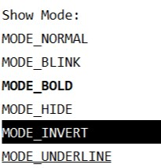

# colorprint
colorprint provide unified print method which can output colored text

the best is that it's cross-platform, support linux and win and every terminal(maybe).

# how2use
install
```bash
pip install colorprint
```

show example
 ```python
from colorprint.example import printall
printall()
```
you can also save it as a.py
```bash
python a.py
```


use
```python
from colorprint.printer import uprint
from colorprint.unicolor import *
uprint("FOREGROUND_GREEN\n", fore=FOREGROUND_GREEN)
uprint("BACKGROUND_WHITE\n", back=BACKGROUND_WHITE)

    print("Show Mode:")
    uprint("MODE_NORMAL\n", mode=MODE_NORMAL)\
        ("MODE_BLINK\n")\
        ("MODE_BOLD\n")\
        ("MODE_HIDE\n")\
        ("MODE_INVERT\n")\
        ("MODE_UNDERLINE\n")
```

the method details api
```python
def uprint(*args,
           fore=None,
           back = None,
           mode = None,
           sep=" ",
           end="",
           handle = "stdout",
           flush = True):
    '''
    Prints the colored values to sys.stdout or sys.stderr.
    :param fore:
    :param back:
    :param mode:
    :param sep: string inserted between values, default a space.
    :param end: string appended after the last value, default a newline.
    :param handle: str, "stdout" or "stderr"
        note:the stderr haven't be tested.
    :param flush: whether to forcibly flush the stream.
    :return: uprint method, you can use
        uprint()()()() to output strings with diff color.
    '''
```
