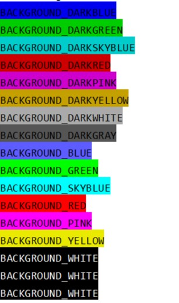

# colorprint
colorprint provide unified print method which can output colored text

the best is that it's cross-platform, support linux and win and every terminal(maybe).

# how2use
install
```bash
pip install colorprint
```

show example
 ```python
from colorprint.example import printall
printall()
```
you can also save it as a.py
```bash
python a.py
```


use
```python
from colorprint.printer import uprint
from colorprint.unicolor import *
uprint("FOREGROUND_GREEN\n", fore=FOREGROUND_GREEN)
uprint("BACKGROUND_WHITE\n", back=BACKGROUND_WHITE)

print("Show Mode:")
uprint("MODE_NORMAL", mode=MODE_NORMAL,end="\n")\
    ("MODE_BLINK",mode=MODE_BLINK)\
    ("MODE_BOLD",mode=MODE_BOLD)\
    ("MODE_HIDE",mode=MODE_HIDE)\
    ("MODE_INVERT",mode=MODE_INVERT)\
    ("MODE_UNDERLINE",mode=MODE_UNDERLINE)

print("Show foreground color.")
uprint("FOREGROUND_BLACK", fore=FOREGROUND_BLACK,end="\n")\
    ("FOREGROUND_DARKBLUE", fore=FOREGROUND_DARKBLUE)\
    ("FOREGROUND_DARKGREEN", fore=FOREGROUND_DARKGREEN)\
    ("FOREGROUND_DARKSKYBLUE", fore=FOREGROUND_DARKSKYBLUE)\
    ("FOREGROUND_DARKRED", fore=FOREGROUND_DARKRED)\
    ("FOREGROUND_DARKPINK", fore=FOREGROUND_DARKPINK)\
    ("FOREGROUND_DARKYELLOW", fore=FOREGROUND_DARKYELLOW)\
    ("FOREGROUND_DARKWHITE", fore=FOREGROUND_DARKWHITE)\
    ("FOREGROUND_DARKGRAY", fore=FOREGROUND_DARKGRAY)\
    ("FOREGROUND_BLUE", fore=FOREGROUND_BLUE)\
    ("FOREGROUND_GREEN", fore=FOREGROUND_GREEN)\
    ("FOREGROUND_SKYBLUE\n", fore=FOREGROUND_SKYBLUE,end="")\
    ("FOREGROUND_RED\n", fore=FOREGROUND_RED)
uprint("FOREGROUND_PINK\n", fore=FOREGROUND_PINK)
uprint("FOREGROUND_YELLOW\n", fore=FOREGROUND_YELLOW)
uprint("FOREGROUND_WHITE\n", fore=FOREGROUND_WHITE)
```

Api of the method:
```python
def uprint(*args,
           fore=None,
           back = None,
           mode = None,
           sep=" ",
           end="",
           handle = "stdout",
           flush = True):
    '''
    Prints the colored values to sys.stdout or sys.stderr.
    :param fore:
    :param back:
    :param mode: 
    :param sep: string inserted between values, default a space.
    :param end: string appended after the last value, default a newline.
    :param handle: str, "stdout" or "stderr"
        note:the stderr haven't be tested.
    :param flush: whether to forcibly flush the stream.
    :return: uprint method, you can use
        uprint()()()() to output strings with diff color.
    '''
```
